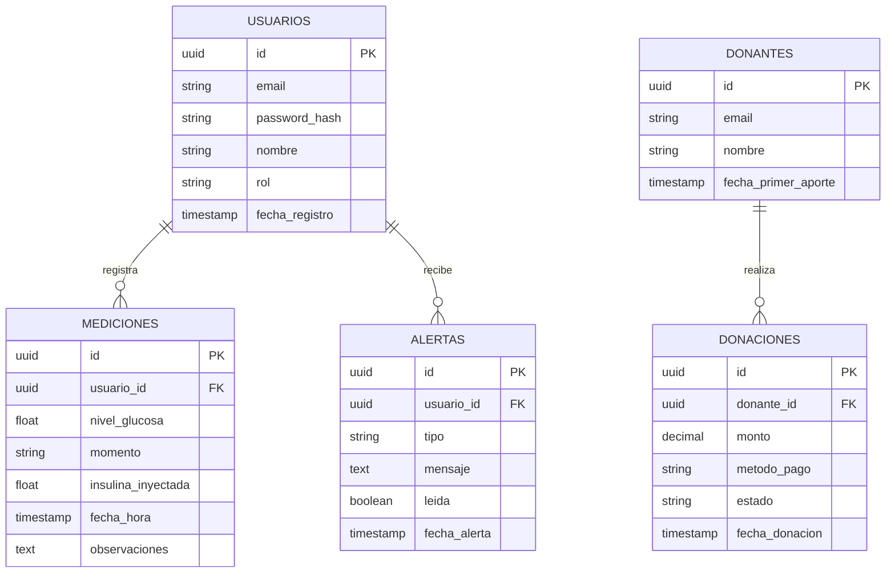

# 🗄️ Esquema de Base de Datos - PostgreSQL

Este documento describe las entidades principales, relaciones y estructura de tablas para **Gluzy**.

---

## 📊 1. Diagrama Entidad-Relación (ER)
El diagrama gráfico se encuentra en `database/diagrama-er.png` (o exportable desde herramientas como DBeaver / draw.io / dbdocs).

---

## 📑 2. Diccionario de Datos

### Tabla: `usuarios`
| Campo | Tipo | Nulo | Descripción |
| :--- | :--- | :--- | :--- |
| `id` | `UUID` | NO (PK) | Identificador único del usuario |
| `email` | `VARCHAR(255)` | NO (UNIQUE) | Correo electrónico de acceso |
| `password_hash` | `VARCHAR(255)` | NO | Hash seguro de la contraseña |
| `nombre` | `VARCHAR(100)` | NO | Nombre completo |
| `rol` | `VARCHAR(30)` | NO | `PACIENTE`, `MEDICO`, `ADMIN` |
| `fecha_registro` | `TIMESTAMP` | NO | Fecha y hora de creación de cuenta |

### Tabla: `mediciones_glucosa`
| Campo | Tipo | Nulo | Descripción |
| :--- | :--- | :--- | :--- |
| `id` | `UUID` | NO (PK) | Identificador de la medición |
| `usuario_id` | `UUID` | NO (FK) | Relación con `usuarios(id)` |
| `nivel_glucosa` | `DECIMAL(5,2)` | NO | Valor de glucosa en mg/dL |
| `momento` | `VARCHAR(50)` | NO | `ayunas`, `antes_comer`, `despues_comer`, etc. |
| `insulina_inyectada` | `DECIMAL(4,2)`| SÍ | Unidades de insulina aplicadas (opcional) |
| `fecha_hora` | `TIMESTAMP` | NO | Momento de la toma |
| `observaciones` | `TEXT` | SÍ | Notas adicionales |

### Tabla: `donaciones`
| Campo | Tipo | Nulo | Descripción |
| :--- | :--- | :--- | :--- |
| `id` | `UUID` | NO (PK) | Identificador de la donación |
| `donante_id` | `UUID` | SÍ (FK) | Relación opcional con donante registrado |
| `monto` | `DECIMAL(10,2)`| NO | Importe monetario |
| `metodo_pago` | `VARCHAR(50)` | NO | `stripe`, `paypal`, etc. |
| `estado` | `VARCHAR(30)` | NO | `COMPLETADA`, `PENDIENTE`, `FALLIDA` |
| `fecha_donacion` | `TIMESTAMP` | NO | Fecha y hora del pago |
