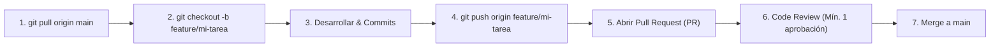

# 🌿 Normas y Flujo de Trabajo en Git

Este documento establece las reglas obligatorias para trabajar con Git en todos los repositorios del proyecto **GluV.IA**. El objetivo es garantizar orden, trazabilidad y evitar conflictos entre los 30 integrantes del equipo.

---

## 📌 1. Estrategia de Ramas (Git Branching)

La rama **`main`** está protegida y siempre debe contener código estable y probado. **Nunca se hace `push` directo a `main`**.

### Convención de Nombres de Ramas
Toda rama debe crearse a partir de `main` (o de la rama base indicada) con el formato:

```plaintext
<tipo>/<descripcion-corta-kebab-case>
```

| Prefijo | Uso | Ejemplo |
| :--- | :--- | :--- |
| `feature/` | Nuevas funcionalidades o pantallas | `feature/login-biometrico` |
| `fix/` | Corrección de errores (bugs) | `fix/calculo-insulina-grafico` |
| `refactor/` | Reestructuración de código sin cambio de comportamiento | `refactor/servicio-autenticacion` |
| `docs/` | Cambios exclusivos en documentación | `docs/actualizar-openapi` |
| `chore/` | Tareas de configuración, dependencias o tooling | `chore/setup-eslint` |
| `test/` | Inclusión o ajuste de pruebas automatizadas | `test/unitarias-repositorio-usuarios` |

---

## 💬 2. Mensajes de Commit (Conventional Commits)

Utilizamos el estándar **Conventional Commits** en español:

```plaintext
<tipo>: <descripción concisa en imperativo>
```

### Ejemplos:
- `feat: agregar endpoint para registro de glucosa`
- `fix: corregir desbordamiento en tarjeta de estadísticas`
- `docs: añadir especificación de endpoints en openapi.yaml`
- `refactor: modularizar componentes del dashboard`

---

## 🔀 3. Ciclo de Vida de una Tarea (Paso a Paso)



### Comandos habituales:

1. **Actualizar tu repositorio local:**
   ```bash
   git checkout main
   git pull origin main
   ```

2. **Crear tu rama de trabajo:**
   ```bash
   git checkout -b feature/registro-mediciones
   ```

3. **Guardar cambios frecuentemente:**
   ```bash
   git add .
   git commit -m "feat: implementar formulario de captura de glucosa"
   ```

4. **Publicar tu rama en GitHub:**
   ```bash
   git push -u origin feature/registro-mediciones
   ```

---

## 🛡️ 4. Pull Requests (PR) y Revisiones de Código

1. **Título claro:** Debe reflejar el objetivo de la PR (ej: `feat(mobile): pantalla de registro de glucosa`).
2. **Descripción:**
   - ¿Qué problema resuelve o qué añade?
   - ¿Cómo se prueba?
   - Capturas de pantalla o vídeos (si aplica a UI).
3. **Requisitos para Merge:**
   - Al menos **1 aprobación** de un compañero o responsable técnico.
   - Puntos de CI/pruebas en verde.
   - Resolver todas las conversaciones o comentarios pendientes.
